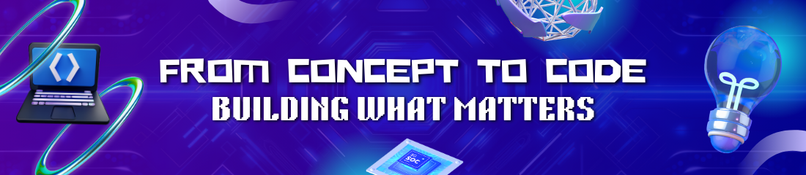

<h1 align="center"><i>Abdessamad EL ATLASSI</i>

Data Analyst

  
  

### About Me
- 📊 4+ years of Experience in **data visualization, business intelligence, and predictive analytics**.
- 🏆 Skilled in **SQL, Power BI, Tableau, Azure, Python (Pandas, Matplotlib, Seaborn, NumPy, Scikit-Learn)**.
- 🚀 Strong background in **dashboard development, process automation, and IT performance optimization**.
- 👨‍🏫 Former **Data Analysis Teacher** with expertise in training professionals on **Python and data analytics**.

---

### 🛠️ Tech Stack

**Languages:**  

**Data Visualization:**  

**Databases & Cloud:**  

**Libraries & Tools:**  

---

### 📌 Work Experience
- **Sofrilog (January 2023 – December 2023)**  
  Developed interactive dashboards, automated data extraction, and implemented predictive models to optimize fleet management and improve delivery efficiency.
  
- **Marjane Group (April 2022 – December 2022)**  
  Deployed KPI tracking solutions via Tableau and Power BI, integrated ERP/CRM systems, and automated reporting for IT performance.
  
- **IQ Factory (March 2021 – March 2022)**  
  Taught data analysis and Python, covering topics such as data wrangling, cleaning, and visualization using Pandas, Matplotlib, Seaborn, and NumPy.
  
- **Sephora (August 2020 – February 2021)**  
  Designed and deployed automated dashboards with Power BI, extracted real-time data from internal databases via SQL and Azure, and proposed IT performance improvements.

---

### 📈 GitHub Stats
  

---

### 📬 Let's Connect!
💬 Open to collaboration on **data science, analytics, and BI projects**. Feel free to reach out!

  
  

